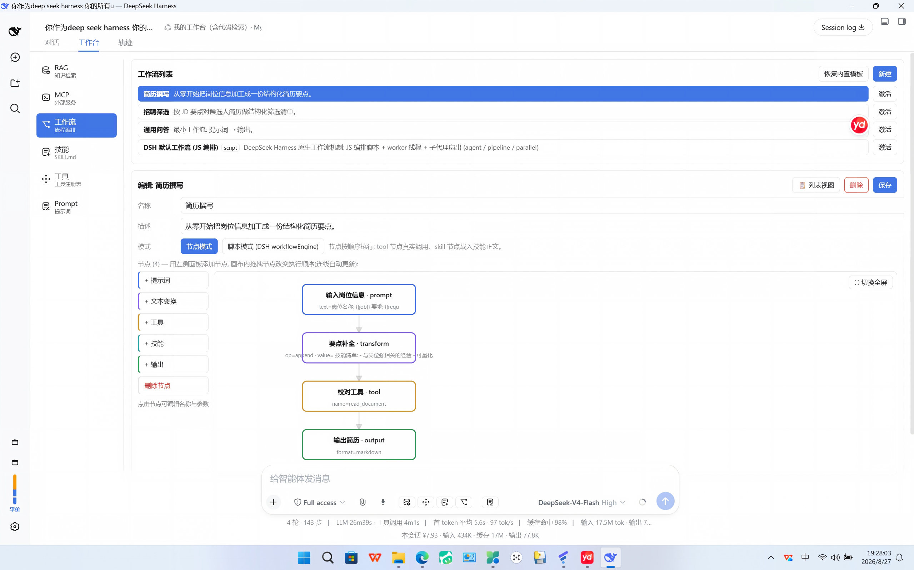
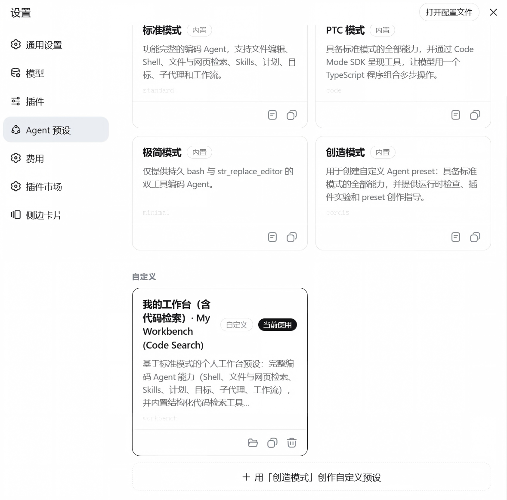

# 🛠️ dsh-workbench

> **智能体的可视化控制台** —— 把 RAG / MCP / 工作流 / 技能 / 工具 / Prompt / 项目状态 七大能力收进一个对话页签,直接在 [DeepSeek Harness](https://github.com/deepseek-ai/deepseek-harness) 里可视化管理。

<div align="center">

[](LICENSE)
[](https://github.com/deepseek-ai/deepseek-harness)
[](#-开发构建)
[](#-参与贡献)
[](README.md)

</div>

DeepSeek Harness 给了模型超能力——但配置它们通常意味着翻文件、改 yaml、啃文档。**dsh-workbench** 把六大核心能力**外加一个项目健康仪表盘**做成**可视化、点一下就能用的控制台**:对话标签栏新增「**工作台**」页签(Chat / Trajectory 之后),并在输入框内提供「**机制开关**」,随时用工作台配置**替换** DSH 的对应机制,一键还原。

界面**跟随 DSH 界面语言自动切换**(中文 / English),并完全基于 **DSH 设计令牌(token)** 构建——**跟随宿主的浅色 / 深色 / 跟随系统主题**,用 DSH 原生图标,视觉零漂移。

<div align="center">

**工作台页签** —— 六大智能体能力,一个地方:



*模块面板 —— 每个能力都点得动:*



</div>

---

## ✨ 为什么用它?

| 😩 没有它 | 🎉 有了它 |
|---|---|
| 调 RAG = 手改 settings yaml、手动重建索引 | 面板里点几下:上传、分块、引擎、重建 |
| MCP = 命令行咒语,工具看不见摸不着 | 添加服务器 → 打开开关,**工具自动注册**进模型工具集 |
| 工作流 = 盲改 JSON | **LogicFlow 拖拽画布**:拖动节点改顺序、连线实时更新、干运行看逐步日志 |
| 技能 / 工具 / 提示词 = 散落各处的配置 | 一个页签搞定浏览、导入、开关、激活 |
| 模型找代码要整文件重读,**token 哗哗地烧** | **`.workbench` 代码索引**:模型按「文件+行号」直达代码,**实测省 87% token** |

所有配置持久化到宿主 `settings` 服务(默认落盘 `~/.dsh/settings.yaml`),重启不丢。

---

## 🧩 功能矩阵

| 模块 | 你能做什么 | 背后机制 |
|---|---|---|
| 📚 **RAG** | 多知识库(文件夹)/ 上传文档(pdf·txt·md,单文件 ≤20MB)/ 分块参数 / 引擎(**bm25 \| vector \| hybrid**)/ 嵌入端点 / 按库重建与检索 | 内置 BM25 + 原创向量引擎(RRF 融合)+ `workbench_search` 工具(支持 `kb_id`) |
| 🔌 **MCP** | 服务器增删改(`url` 或 `command`/`args`/`env`/`headers`)/ 启用禁用 / 连接测试 / **启用即自动注册 `wb_mcp__*` 工具** | `@modelcontextprotocol/sdk` 动态连接,与官方 `mcp__*` 桥共存 |
| 🔄 **工作流** | 内置模板 / **LogicFlow 拖拽画布**(全屏、实时重排重连)/ 内联节点编辑 / 干运行 + 逐步日志 / **脚本模式**(完整 `workflowEngine` 编排) | 确定性干运行执行器 + 宿主 `workflowEngine` 委托(agent / pipeline / parallel) |
| 🧩 **技能** | 浏览已安装技能 / 导入本地 `SKILL.md` 到 `~/.dsh/skills/` / 关注开关 | `ctx.skills` 注册表 |
| 🛠️ **工具** | **DSH 全量工具**(含已隐藏)/ 传参测试调用 / 「对模型隐藏」运行时开关 | `ctx.tools` 注册表 + `ctx.tools.restrict({ deny })` 即时生效 |
| 📝 **Prompt** | 内置 8 套领域模板 / CRUD / `{{var}}` 占位符预览 / 切换生效 / 📝 输入框弹层(最近 3 个 + 取消 + **注入预览**) | 宿主动态 section `workbench:active-prompt`,未激活时**零上下文成本** |
| 📇 **代码索引** | 每个代码目录维护 `.workbench/` 索引(功能块 → 文件 + 起始/结束行 + 功能注释),时间戳快照 + 实时 `latest.md` | 模型驱动宿主工具:`workbench_code_index`(scan/commit)、`workbench_code_locate` —— **先定位再按行读,告别整文件扫描** |
| 🩺 **项目状态** | **当前工作区**健康仪表盘:六维状态卡(RAG / MCP / 技能 / 工具 / 工作流 / 结构)· 总体健康分 · **依赖图 & 调用图**(可点击 SVG)· 带注释覆盖的框架树 · **点任意卡片/节点 → 面板内直接看对应源码行** | `workbench_project_status` 工具 + `src/projectstatus.ts` 静态分析(import → 依赖边、调用引用 → 调用边、TODO/FIXME 扫描、注释覆盖)——报告落盘 `.workbench/project-status.md` + `.json` |

### 🎛️ 机制开关(输入框内)

点击输入框工具行的图标,即可用工作台配置**替换** DSH 内置机制:

- 📚 **RAG** — 默认 / 自定义 / 指定知识库
- 🛠️ **工具** — 默认全量 / 按隐藏过滤
- 🧩 **技能** — 原生 / 注入工作台清单
- 🔄 **工作流** — 原生 / 按激活工作流执行

「还原该机制」(或「一键还原默认」)立即恢复 DSH 行为,同时清空工具/技能隐藏配置。

---

## 📇 代码索引 —— 省 token 的杀手锏

模型为了找一个函数整文件重读,是最大的隐性 token 泄漏。dsh-workbench 为每个代码目录维护一份 **`.workbench/` 索引**——紧凑 Markdown,把每个功能块映射到「**文件 + 起始/结束行 + 功能注释**」。模型:

1. **改完代码后** → 调用 `workbench_code_index`(`scan` 扫结构 → 补功能注释 → `commit` 写快照),自动重建索引;
2. **写码之前** → 调用 `workbench_code_locate`,按「文件 + 起始/结束行 + 功能描述」直达代码,再按行精确读取。

用本仓库真实源码 + 真实索引实测(5 个真实编程任务,两臂同口径):

| 任务 | 不用工具(读全文) | 用工具(locate+按行) | 节省 |
|---|---|---|---|
| 修改 locate 定位打分逻辑 | 14,260 | 1,229 | **91%** |
| 调整 BM25 打分 termScore | 2,772 | 646 | 77% |
| 给 commitIndex 加功能 | 14,260 | 1,587 | 89% |
| 改客户端 RagPanel 上传逻辑 | 4,247 | 2,298 | 46% |
| 给 RAG 重建加新参数 | 20,494 | 1,641 | 92% |
| **合计** | **56,033** | **7,401** | **87%** |

随时复现:`node scripts/token-compare.mjs --dir <代码目录>`。

**行号永远是最新的**——要么用插件内置 watch(settings 里配置 `workbench.indexWatchDirs`,宿主自动轮询维护),要么用独立脚本(`scripts/watch-workbench.mjs` 常驻守护 / `scripts/refresh-workbench.mjs` 一次性刷新,可挂 git hook、CI、npm scripts)。

> **近期修复**(V7):`workbench_code_find` 现在能召回**嵌套**的函数/类/常量(声明正则不再只认顶层,嵌套声明也不再被跳过);`workbench_code_index commit` 会**先继承上一版注释再合并本次注解**,部分提交不再冲掉旧注释。

---

## 🩺 项目状态 —— 动手前先看清整个项目

就像运维工程师改系统前先看调用图一样,**「项目状态」**页签给模型(和你)一份当前工作区的一眼健康报告——让每次改动都不再「盲改」:

- **六维状态卡** —— RAG / MCP / 技能 / 工具 / 工作流 / 结构,每维带状态行、🟢🟡🔴 健康徽章与 0–100 分数条;
- **总体健康分** —— 融合配置侧信号(MCP 是否连接?RAG 索引是否构建?技能/工具/工作流是否就绪?)与代码侧信号(注释覆盖率、TODO/FIXME 数、索引是否过期、超大文件);
- **依赖图** —— 文件 → 文件的 import/require 依赖边,可点击 SVG;
- **调用图** —— 函数 → 函数的调用边(可解析到项目内符号),同样可点击;
- **框架树** —— 目录 → 文件 → 功能块,标注注释覆盖与 TODO/FIXME 数;
- **点哪看哪** —— 点任意卡片/节点,面板内直接展示**带行号的对应源码**;改代码前也可让模型用 `workbench_project_status` 工具读同一份报告;
- **字符化落盘** —— 每次扫描重写项目根下的 `.workbench/project-status.md`(人/模型可读)+ `.workbench/project-status.json`(机器可读)。

默认分析目录是**当前会话的工作区**(`agent.session.header.cwd`),再回退到 `workbench.indexWatchDirs`——所以它分析的就是你正在干活的那个项目。

---

## 🚀 快速开始

```sh
# 方式一: 从 npm 安装(发布后)
dsh plugin --profile web add dsh-workbench

# 方式二: 从 GitHub 安装
dsh plugin --profile web add git+https://github.com/19892500339/dsh-workbench.git

# 方式三: 本地开发
cd dsh-workbench && npm install && npm run build
dsh plugin --profile web add link:<本仓库绝对路径>
```

装完后**硬刷新浏览器**(`Ctrl/Cmd + Shift + R`),标签栏出现「工作台」,输入框工具行出现 📚🛠️🧩🔄📝 图标。

---

## 🖥️ 上手五步

**① 上传文档,让模型检索它**
「工作台 → RAG」→ 添加知识库(名称 + 文件夹绝对路径)→ 上传 `.pdf/.txt/.md` →(可选)引擎切到 `vector`/`hybrid` 并填嵌入端点 → 重建索引。然后在输入框点 📚 →「工作台知识库」→ 勾选目标库 → 提问。模型会调用 `workbench_search` 并带上对应的 `kb_id`。

**② 一分钟接入 MCP 服务器**
「工作台 → MCP」→ 添加服务器(stdio 本地命令或 http 远程地址)→ 保存 → **启用**。它的工具自动注册为 `wb_mcp__*`,出现在「工作台 → 工具」里,模型可直接调用。

**③ 拖出一张工作流**
「工作台 → 工作流」→ 选内置模板(或新建)→「🎨 拖拽画布」→ 添加 `+ 提示词 / 文本变换 / 工具 / 技能 / 输出` 节点 → **拖动节点调整执行顺序**(连线实时重连)→ 干运行看逐步日志 → 点「**激活**」,再在输入框点 🔄 →「按激活工作流执行」。

**④ 激活一条提示词模板**
「工作台 → Prompt」→ 选 8 套领域模板之一(或自建,支持 `{{var}}`)→「切换生效」。下一个模型步骤起,系统提示词即注入;📝 弹层显示**与模型实际收到完全一致**的注入预览,方便核对。

**⑤ 把某个工具藏起来**
「工作台 → 工具」→ 对任意工具勾选「隐藏」(经 `ctx.tools.restrict` 即时生效),取消勾选恢复。

**⑥ 改代码前,先看项目状态**
「工作台 → 项目状态」→ 默认自动定位**当前会话工作区** → 看六维健康卡,再切到「依赖图 / 调用图」页签,点节点直达对应源码行。同一份报告模型也能通过 `workbench_project_status` 工具读取——改代码前先调用它。

---

## 🏗️ 开发构建

```sh
npm install
npm run build      # tsc 类型声明 + tsdown 双产物(lib/index.js 宿主 + lib/client.js 客户端)
npm test           # 引擎/向量/提示词单测
npm run typecheck
```

客户端产物为 DSH web module-loader 格式(`window.__ModuleLoader__.load({ id: 'dsh-workbench', factory })`)。

### 🌐 国际化与主题

- 全部界面文案走 `src/client/i18n.ts` 双语字典(zh/en);客户端订阅 DSH 的 `locale` 服务,DSH 切换语言时工作台同步切换,无需重启。
- 整个 UI 基于 **DSH 设计令牌**(`var(--dsw-alias-*)`)构建:跟随宿主浅色/深色/系统主题,使用 DSH 原生图标集——与原生界面零视觉漂移。

---

## 🗂️ 仓库结构

```
dsh-workbench/
├── package.json            # exports + dsh.bundle.patch + dsh.client 双入口声明
├── cordis.patch.yml        # 宿主行插入(bundle patch)
├── tsconfig*.json / tsdown.config.ts
├── src/
│   ├── index.ts            # 宿主入口: 工具 + 机制替换 + 动态 section + RPC + settings
│   ├── config.ts           # settings 命名空间 schema(schemastery)
│   ├── search.ts           # BM25 检索引擎(零依赖)
│   ├── codeindex.ts        # .workbench 索引: scan → annotate → commit → locate
│   ├── projectstatus.ts    # 项目健康分析: 依赖图/调用图、TODO 扫描、报告落盘 .workbench
│   ├── embedding.ts        # 向量引擎(OpenAI 兼容端点 + RRF 融合)
│   ├── mcp.ts              # MCP 连接/测试/自动注册工具
│   ├── documents.ts        # 文档解析(pdf-parse / txt / md)
│   ├── workflow.ts         # 工作流模板 + 干运行执行器
│   ├── prompts.ts          # 内置领域模板 + 注入转义
│   ├── api.ts              # /workbench/api 前缀路由(同源校验 + {ok,value} 信封)
│   ├── shared/types.ts     # 双端共享 JSON 类型
│   └── client/             # React UI: 页签 + 输入框机制条/提示词弹层 + i18n + modules/
├── scripts/                # watch-workbench / refresh-workbench / token-compare
└── tests/                  # node --test 单测(BM25/向量/提示词转义)
```

---

## 🧭 与生态的关系

DSH 生态已有各能力的单点插件(知识库 [dsh-kb-sieve](https://github.com/omdsh-dev/dsh-kb-sieve)、MCP [dsh-exa-mcp](https://github.com/MicroHEROX/dsh-exa-mcp)、技能 [dsh-skill-manager](https://github.com/JimmyJin2006/dsh-skill-manager) 等),但**没有把六大能力 + 机制替换 + 代码索引收进一个对话页签与输入框**的产品——这正是本插件的位置。同名 [deepseek-harness-workbench-plugin](https://github.com/loadingvx/deepseek-harness-workbench-plugin) 是 IDE 风格三栏工作台,定位互补。

---

## 🤝 参与贡献

欢迎提 issue、PR 与建议。上架 npm 前请确认 `package.json` 的 `repository.url` 指向你自己的仓库。开发注意事项:`systemPrompt.variable` 名称须匹配 `/^[a-z][a-z0-9_]*$/`;`systemPrompt.section` 允许冒号;详见 [docs/ERROR-FIX-LOG.md](./docs/ERROR-FIX-LOG.md) 与 [docs/ARCHITECTURE.md](./docs/ARCHITECTURE.md)。

## 🧾 许可

原创实现,**MIT** 许可;不粘贴第三方代码,参照项目仅在注释致谢。运行时依赖仅在 package.json 声明:`@modelcontextprotocol/sdk`(MIT)、`@logicflow/core`(Apache-2.0)、`pdf-parse`(MIT)、`@deepseek-ai/*`(MIT)。
